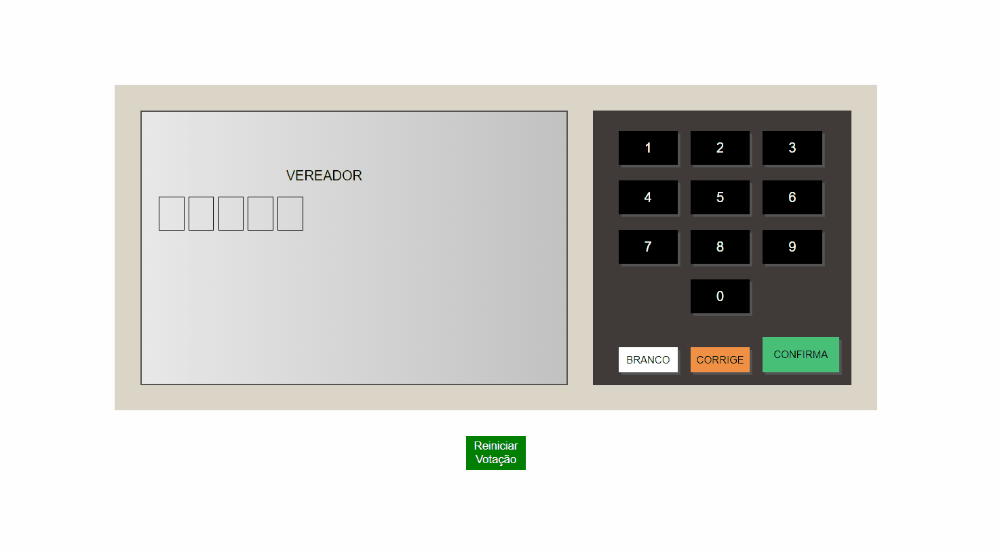

# Sobre o Projeto 🚀

Desenvolvi uma Urna Eletrônica com o design real, funcionalidades de click nos botões e lógica de programação com o JavaScript.

# Tecnologias Utilizadas

HTML, CSS e Java Script

# Tela de Aplicação 

